# Predictive Maintenance & Machine Failure Prediction (AI4I 2020)

Machine failure prediction on the **AI4I 2020 Predictive Maintenance Dataset**, built as a reproducible scikit-learn / XGBoost pipeline with SHAP explainability. The workflow follows the methodology of Sharma et al. (2026) (see [Citation](#citation)): stratified split, five-fold cross-validated grid search, engineered operating-condition features, and SHAP-based interpretation.

**Best model: XGBoost, 99.0% accuracy, 0.93 precision, 0.76 recall, 0.84 F1, 0.98 ROC-AUC, 0.89 PR-AUC** on a stratified held-out test set (2,000 samples, 68 failures).

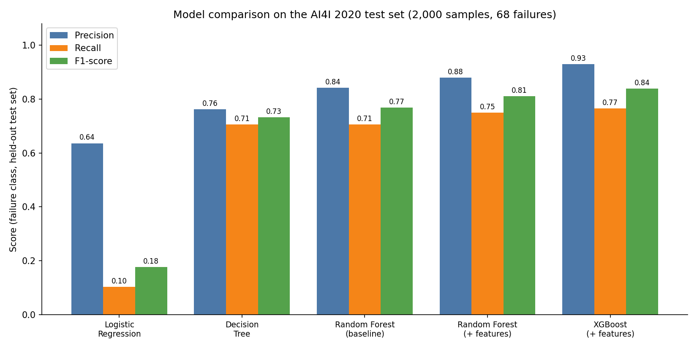

---

## Table of Contents

1. [Problem](#problem)
2. [Dataset](#dataset)
3. [Pipeline Overview](#pipeline-overview)
4. [Step-by-Step Walkthrough](#step-by-step-walkthrough)
5. [Results](#results)
6. [Explainability with SHAP](#explainability-with-shap)
7. [Comparison with the Reference Paper](#comparison-with-the-reference-paper)
8. [Limitations](#limitations)
9. [Getting Started](#getting-started)
10. [Repository Structure](#repository-structure)
11. [Citation](#citation)

---

## Problem

Unplanned equipment failure is expensive. Predictive maintenance uses sensor readings to flag machines that are likely to fail *before* they do. The difficulty is that failures are rare: here only **3.39%** of observations are failures, so a model that always predicts "no failure" already scores 96.6% accuracy while being useless. This project therefore optimizes and reports **precision, recall, F1, ROC-AUC and PR-AUC**, not accuracy alone.

## Dataset

[AI4I 2020 Predictive Maintenance Dataset](https://archive.ics.uci.edu/dataset/601/ai4i+2020+predictive+maintenance+dataset): 10,000 synthetic machine records, no missing values.

| Feature | Description |
|---|---|
| `Type` | Product quality variant: L (60%), M (30%), H (10%) |
| `Air temperature [K]` | Mean ≈ 300 K |
| `Process temperature [K]` | Mean ≈ 310 K |
| `Rotational speed [rpm]` | Mean ≈ 1539 rpm, right-skewed |
| `Torque [Nm]` | Mean ≈ 40 Nm, approximately normal |
| `Tool wear [min]` | 0 to 253 min |
| **`Machine failure`** | **Target**: 1 = failed (339 records), 0 = normal (9,661 records) |

`UDI` and `Product ID` are identifiers and are dropped. The failure-mode flags (`TWF`, `HDF`, `PWF`, `OSF`, `RNF`) are **deliberately excluded from the features**: they are components of the target itself and would not be known at prediction time, so using them would be target leakage.

## Pipeline Overview

```
Raw CSV → EDA → Stratified 80/20 split → Dummy baseline → Logistic Regression
        → Decision Tree (GridSearchCV) → Random Forest (GridSearchCV)
        → Feature engineering → Random Forest v2 → XGBoost (GridSearchCV)
        → Evaluation → SHAP explainability
```

All models are wrapped in a scikit-learn `Pipeline` with a `ColumnTransformer` (`StandardScaler` for numeric features, `OneHotEncoder` for `Type`), so preprocessing is fit only on training folds and never leaks into validation or test data.

---

## Step-by-Step Walkthrough

### 1. Data inspection

`df.info()` and `df.describe()` confirm 10,000 rows, 14 columns and zero missing values. The target is highly imbalanced (9,661 vs 339). Grouping by `Machine failure` shows how the failure-mode flags relate to the target, which is how the leakage risk above was identified.

### 2. Exploratory data analysis

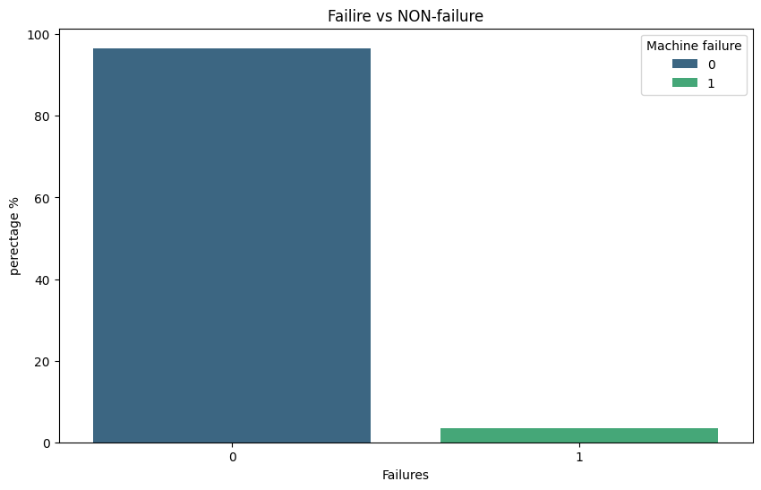

Class imbalance: failures make up only 3.4% of the data.

<table>
<tr>
<td>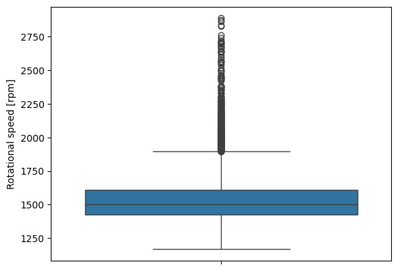</td>
<td>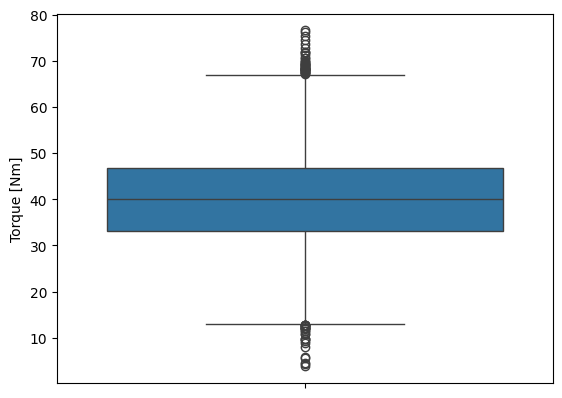</td>
</tr>
<tr>
<td align="center">Rotational speed: right-skewed with high-end outliers</td>
<td align="center">Torque: roughly symmetric with tails on both sides</td>
</tr>
</table>

Outliers in speed and torque were **kept**: they represent legitimate operating conditions, not measurement errors.

<table>
<tr>
<td>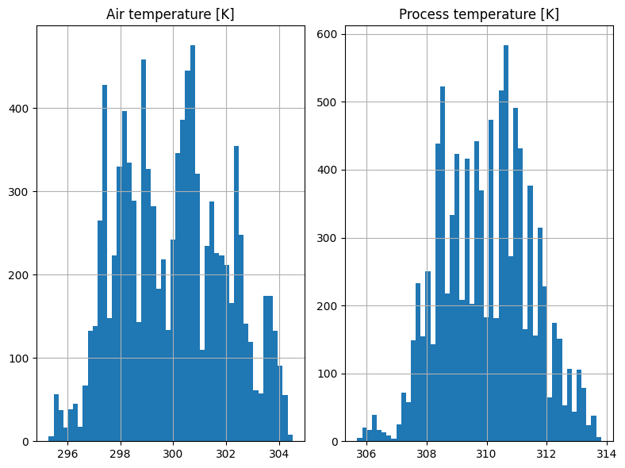</td>
<td>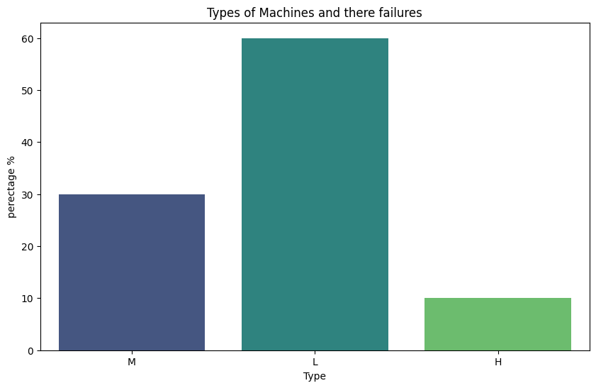</td>
</tr>
<tr>
<td align="center">Air and process temperature distributions</td>
<td align="center">Machine type distribution (L / M / H)</td>
</tr>
</table>

### 3. Train / test split

An 80/20 **stratified** split (`random_state=42`) keeps the failure rate at ~3.4% in both sets: 8,000 training rows and 2,000 test rows (68 failures). The test set is not used for model selection.

### 4. Dummy baseline

A `DummyClassifier(strategy="most_frequent")` reaches **96.6% accuracy with 0 precision, 0 recall and 0 F1**. This is the reference point showing why accuracy is misleading here.

### 5. Logistic Regression (linear baseline)

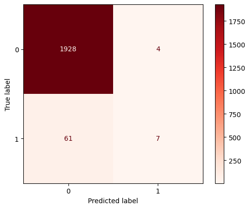

Only 7 of 68 failures were caught (recall 0.10, F1 0.18). Failures here are driven by non-linear interactions, which a linear boundary cannot capture. This motivates tree-based models.

### 6. Decision Tree with grid search

Five-fold cross-validated `GridSearchCV` over depth, split/leaf sizes, criterion and class weights (**5,400 candidates, 27,000 fits**), optimizing **F1**. Best configuration: `entropy`, `max_depth=8`, `min_samples_split=5`, `min_samples_leaf=2`, `class_weight={0:1, 1:2}`. Test F1 jumps to **0.73**.

### 7. Random Forest with grid search

Grid search over `n_estimators`, depth, split/leaf sizes, `max_features` and class weights (864 candidates, 4,320 fits). Test F1 improves to **0.77**.

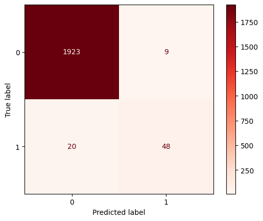

The notebook also sweeps the decision threshold (0.20 to 0.56) to illustrate the precision/recall trade-off: lowering the threshold to 0.20 raises recall to 0.88 but drops precision to 0.42. This sweep is exploratory only; the reported results use the default 0.5 threshold.

### 8. Feature engineering

Three physically motivated features were added, matching the engineered variables used in the reference paper:

```python
Torque_Speed_Ratio     = Torque [Nm]      / Rotational speed [rpm]
Wear_Speed_Ratio       = Tool wear [min]  / Rotational speed [rpm]
Temperature_Difference = Air temperature [K] - Process temperature [K]
```

Retraining the Random Forest with them raises test F1 from 0.77 to **0.81** and ROC-AUC from 0.964 to **0.982**.


<details>
<summary>Example tree from the Random Forest (click to expand)</summary>

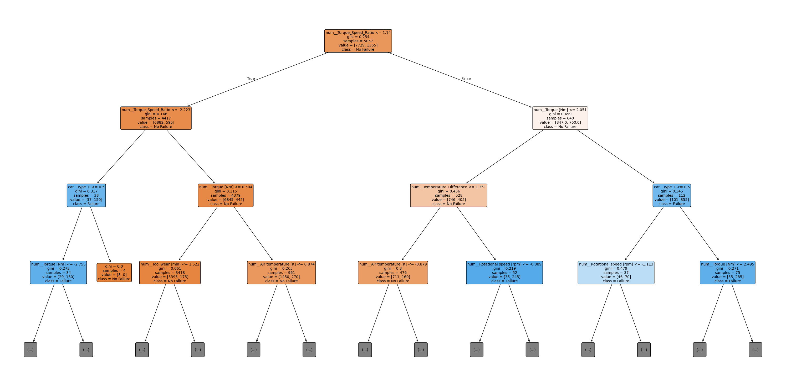

</details>

### 9. XGBoost with grid search

Five-fold grid search over `n_estimators`, `learning_rate`, `max_depth`, `subsample`, `colsample_bytree`, `gamma`, `reg_alpha` and `reg_lambda` (576 candidates, 2,880 fits). Best configuration: `n_estimators=200`, `learning_rate=0.1`, `max_depth=7`, `subsample=0.8`, `gamma=1`, `reg_alpha=0`, `reg_lambda=1`, `colsample_bytree=1.0`.

### 10. Correlation analysis

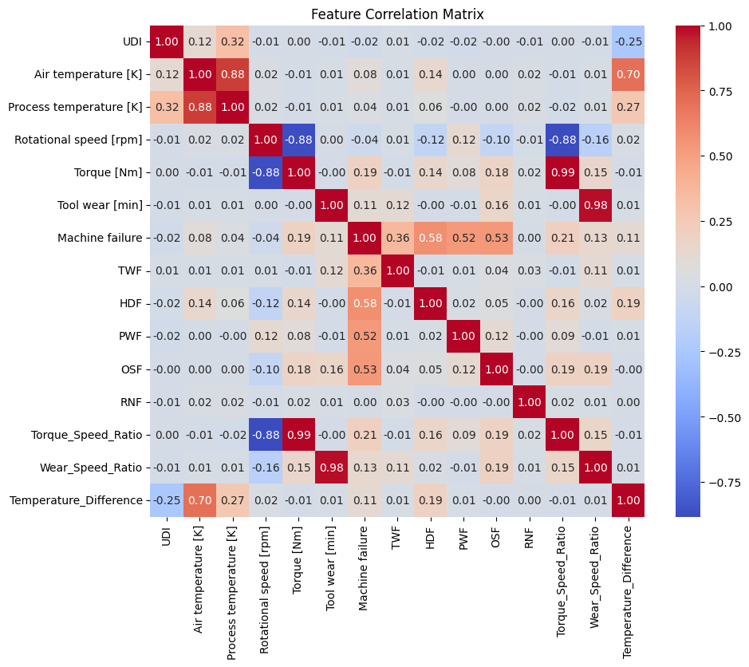

Individual features correlate only weakly with failure (largest: `Torque_Speed_Ratio` r = 0.21, `Torque` r = 0.19), which explains why linear models struggle and why the engineered ratios help.

### 11. Explainability

SHAP `TreeExplainer` is applied to the final XGBoost model to see *why* it flags a machine. See the next sections.

---

## Results

Held-out test set, failure class (positive = 1). MCC is computed from each model's confusion matrix.

| Model | Accuracy | Precision | Recall | F1 | ROC-AUC | PR-AUC | MCC | TP / FP / FN |
|---|---|---|---|---|---|---|---|---|
| Dummy (most frequent) | 0.9660 | 0.000 | 0.000 | 0.000 | n/a | n/a | n/a | 0 / 0 / 68 |
| Logistic Regression | 0.9675 | 0.636 | 0.103 | 0.177 | 0.899 | 0.421 | 0.247 | 7 / 4 / 61 |
| Decision Tree (tuned) | 0.9825 | 0.762 | 0.706 | 0.733 | 0.890 | 0.677 | 0.724 | 48 / 15 / 20 |
| Random Forest (tuned) | 0.9855 | 0.842 | 0.706 | 0.768 | 0.964 | 0.807 | 0.764 | 48 / 9 / 20 |
| Random Forest + engineered features | 0.9880 | 0.879 | 0.750 | 0.810 | 0.982 | 0.835 | 0.806 | 51 / 7 / 17 |
| **XGBoost + engineered features** | **0.9900** | **0.929** | **0.765** | **0.839** | **0.983** | **0.889** | **0.838** | **52 / 4 / 16** |

**Takeaways**

- Accuracy is nearly useless here (the dummy model scores 96.6%), so F1, PR-AUC and MCC are the metrics that matter.
- Non-linear models give the largest jump (F1 0.18 to 0.73), and feature engineering plus boosting add the rest.
- XGBoost misses 16 of 68 failures while raising only 4 false alarms across 1,932 healthy machines.

---

## Explainability with SHAP

**Global importance:** torque, tool wear and the engineered ratio features dominate; machine `Type` contributes very little.

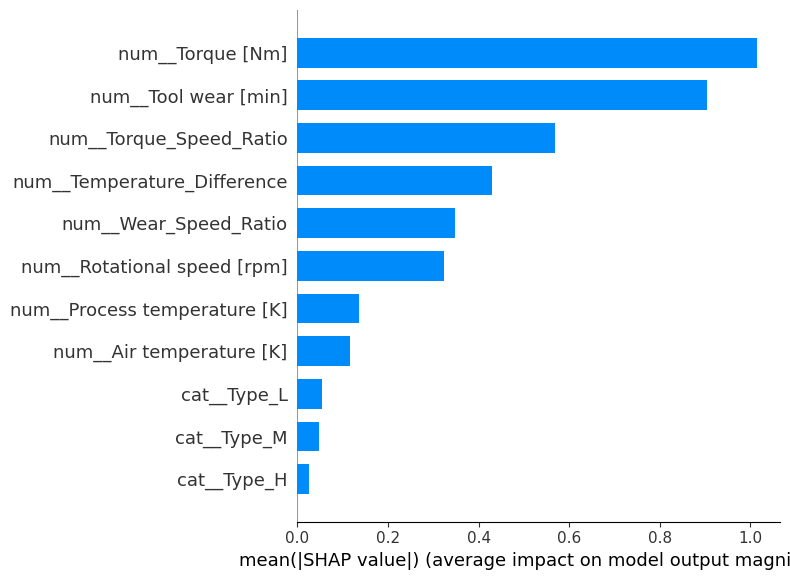

**Direction of effects:** high torque, high tool wear and a large wear/speed ratio push predictions toward failure; the colour shows the feature value and the x-position its impact.

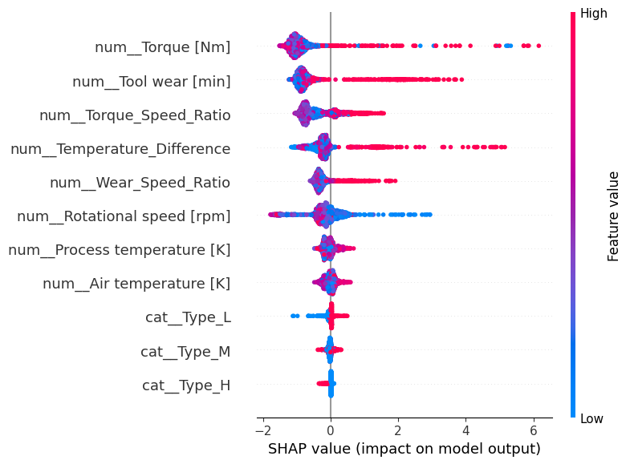

**Torque dependence:** failure risk is flat over most of the torque range and then rises sharply at high torque, a non-linear effect a logistic regression cannot represent.

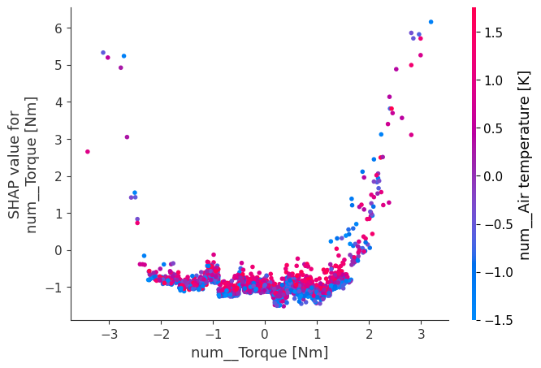

**Single-prediction explanation (waterfall):**

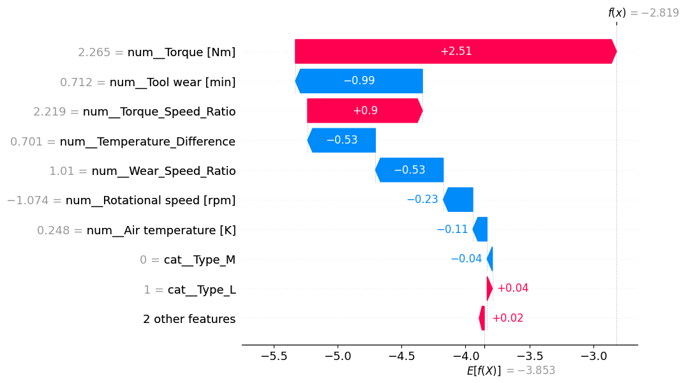

---

## Comparison with the Reference Paper

This project reproduces the *approach* of the reference paper; it is not an exact replication. The paper reports the following on the same dataset, alongside results from this repository:

| Model | Paper F1 | This repo F1 | Paper MCC | This repo MCC |
|---|---|---|---|---|
| XGBoost | 0.8293 | 0.8387 | 0.8289 | 0.8378 |
| Random Forest | 0.8067 | 0.8095 | 0.8097 | 0.8061 |
| Decision Tree | 0.6418 | 0.7328 | 0.6295 | 0.7244 |
| Logistic Regression | 0.3018 | 0.1772 | 0.3600 | 0.2472 |

Both reach the same conclusion: **XGBoost > Random Forest > Decision Tree > Logistic Regression**, and torque, tool wear and the torque-speed ratio are the key drivers. Differences are expected, because the random seeds, splits and hyperparameter grids differ, and the paper's Logistic Regression appears to use class-balancing (its recall is 0.87) whereas the one here does not (recall 0.10). Support Vector Machine is evaluated in the paper but not implemented here.

## Limitations

- **Synthetic data.** AI4I 2020 is simulated, and its failure modes follow explicit rules (for example, heat-dissipation failure depends on the temperature gap and speed, and power failure on torque × speed). High scores here do not guarantee the same performance on real sensor data.
- **Small test set.** The test set has only 68 failures, so one prediction changes recall by about 1.5 points. The gap between Random Forest and XGBoost is only a few samples, so the ranking is suggestive rather than conclusive. Repeated stratified cross-validation or multiple seeds would give confidence intervals.
- **Single split.** All reported numbers come from one train/test split (`random_state=42`).
- **Binary task only.** Multiclass fault-type diagnosis (HDF, PWF, OSF, TWF, RNF) is not covered.
- **Threshold exploration uses the test set.** The Random Forest threshold sweep is illustrative; a deployed threshold should be chosen on validation data.

## Future Work

- Add MCC and confusion-matrix reporting directly in the notebook's `evaluation()` helper
- Cost-sensitive learning / SMOTE comparison
- Add LightGBM, CatBoost, SVM and KNN to match the paper's full model list
- Multiclass fault diagnosis
- Physically meaningful features such as mechanical power (torque × angular velocity)
- Deploy as a small API or dashboard

---

## Getting Started

```bash
git clone https://github.com/<your-username>/<your-repo>.git
cd <your-repo>

python -m venv .venv
source .venv/bin/activate        # Windows: .venv\Scripts\activate
pip install -r requirements.txt

jupyter notebook predictive_maintenance.ipynb
```

The notebook expects `ai4i2020.csv` in the same folder (included, or download it from the [UCI repository](https://archive.ics.uci.edu/dataset/601/ai4i+2020+predictive+maintenance+dataset)).

## Repository Structure

```
.
├── predictive_maintenance.ipynb   # Full analysis and modelling
├── ai4i2020.csv                   # Dataset
├── images/                        # Figures used in this README
├── requirements.txt
└── README.md
```

---

## Citation

This project adopts the methodology of the following paper. If you use this work, please cite it:

> Sharma, A., Kumar, S., Kambli, R. M., Channi, A. S., Das, B., & Rai, A. (2026). Machine Learning-Based Predictive Maintenance and Fault Diagnosis for Intelligent Mechanical Systems. *Journal of Intelligent Decision Making and Information Science*, 3(8s), 1212-1224. https://doi.org/10.59543/jidmis.v3i.17135

```bibtex
@article{sharma2026predictive,
  author  = {Sharma, Abhishek and Kumar, Sujesh and Kambli, Ramkrishna Mohan and Channi, Arvinder Singh and Das, Baijnath and Rai, Anjul},
  title   = {Machine Learning-Based Predictive Maintenance and Fault Diagnosis for Intelligent Mechanical Systems},
  journal = {Journal of Intelligent Decision Making and Information Science},
  volume  = {3},
  number  = {8s},
  pages   = {1212--1224},
  year    = {2026},
  doi     = {10.59543/jidmis.v3i.17135}
}
```

**Dataset:**

> Matzka, S. (2020). Explainable Artificial Intelligence for Predictive Maintenance Applications. *2020 Third International Conference on Artificial Intelligence for Industries (AI4I)*, pp. 69-74. IEEE.

The dataset is available from the [UCI Machine Learning Repository](https://archive.ics.uci.edu/dataset/601/ai4i+2020+predictive+maintenance+dataset) under a CC BY 4.0 license.

**Other tools:** [scikit-learn](https://scikit-learn.org/), [XGBoost](https://xgboost.readthedocs.io/) (Chen & Guestrin, 2016), [SHAP](https://shap.readthedocs.io/) (Lundberg et al., 2020).

## Author

**Mohamed Badawy** — Computer and Communication Engineering, Mansoura University
[GitHub](https://github.com/Mohamadadel510) · [LinkedIn](https://www.linkedin.com/in/eng-mohamed-badwy)
